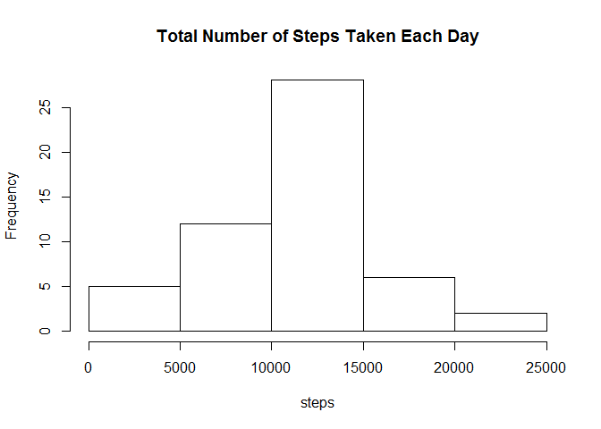
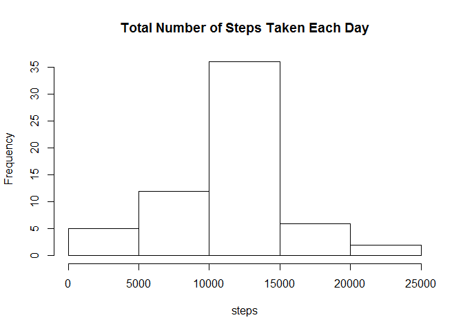
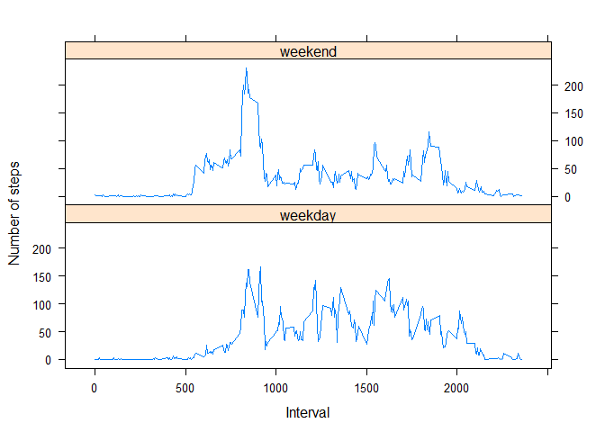

# Reproducible Research: Peer Assessment 1

## Loading and preprocessing the data


```r
activity <- read.csv("activity.csv")
```


## What is mean total number of steps taken per day?

Total number of steps taken per day. NAs will be ignored.


```r
stepsbyday <- aggregate(steps ~ date, data = activity, sum, na.rm=TRUE)
```

  
A histogram of the total number of steps taken each day

```r
hist(stepsbyday$steps, xlab="steps", main="Total Number of Steps Taken Each Day")
```

 

Mean of the total number of steps taken per day

```r
mean(stepsbyday$steps, na.rm=TRUE)
```

```
## [1] 10766.19
```

Median of the total number of steps taken per day

```r
median(stepsbyday$steps, na.rm=TRUE)
```

```
## [1] 10765
```

## What is the average daily activity pattern?

A time series plot (i.e. type = "l") of the 5-minute interval (x-axis) and the average number of steps taken, averaged across all days (y-axis)

```r
stepsbyinterval <- aggregate(steps ~ interval, data = activity, mean, na.rm=TRUE)
plot(stepsbyinterval$interval
     , stepsbyinterval$steps
     , ylab = "Steps"
     , col="black"
     , main=""
     , type="l"
     , xlab="Interval")
```

 

The 5-minute interval, on average across all the days in the dataset, contains the maximum number of steps

```r
stepsbyinterval[which.max(stepsbyinterval$steps), 1]
```

```
## [1] 835
```

## Imputing missing values

The total number of missing values in the dataset (i.e. the total number of rows with NAs)

```r
sum(!complete.cases(activity))
```

```
## [1] 2304
```

Fills in the gap using the mean for that 5-minute interval

```r
for(i in which(!complete.cases(activity))){
  activity[i, 1] <- stepsbyinterval[stepsbyinterval$interval == activity[i, 3], 2]
}
```


Updated histogram

```r
stepsbyday <- aggregate(steps ~ date, data = activity, sum, na.rm=TRUE)
hist(stepsbyday$steps, xlab="steps", main="Total Number of Steps Taken Each Day")
```

 

Mean of total number of steps taken per day

```r
mean(stepsbyday$steps, na.rm=TRUE)
```

```
## [1] 10766.19
```

Median total number of steps taken per day

```r
median(stepsbyday$steps, na.rm=TRUE)
```

```
## [1] 10766.19
```

After imputing missing data, mean and median total number of steps taken per day becomes the same. mean remains unchanged. Median is a little higher than the privous estimate. The overall impact of imputing missing data on the estimates of the total daily number of steps is miminum.  


## Are there differences in activity patterns between weekdays and weekends?

A time series plot (i.e. type = "l") of the 5-minute interval (x-axis) and the average number of steps taken, averaged across all weekday days or weekend days (y-axis)  


```r
library(lattice)
library(lubridate)
library(plyr)
```

```
## 
## Attaching package: 'plyr'
## 
## The following object is masked from 'package:lubridate':
## 
##     here
```

```r
activity <- mutate(activity, daytype = ifelse(lubridate::wday(date) %in% c(1, 7) == TRUE, "weekday", "weekend"))
activity$daytype <- as.factor(activity$daytype )

stepsbyinterval <- aggregate(steps ~ interval +  daytype, data = activity, mean, na.rm=TRUE)
xyplot(stepsbyinterval$steps ~ stepsbyinterval$interval | daytype
      , data = stepsbyinterval
      , type="l"
      , layout = c(1, 2)
      , xlab="Interval"
      , ylab="Number of steps")
```

 
